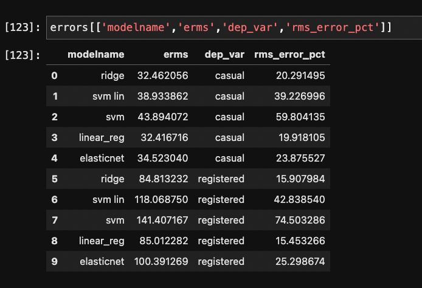
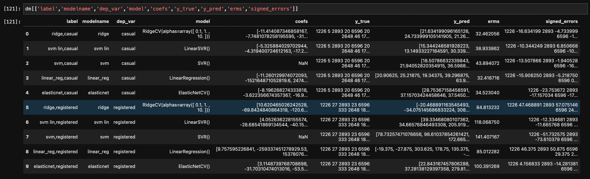

# Introductory Discussion

## Strategy for Prediction of Total Scooter Rentals By Hour
* to predict `count`, we make two models, each trained with same training set and input X, each predicting one of the dependent variables `casual`, and `registered`
* this is necessary because `registered` rentals and `casual` rentals depend stroingly on disjount sets of inputs
* while both estimators show there is a dependence on the cyclic time varibles and obvious weather patterns (weekends result in larger rentals of both kinds... good weather results in more ridership, both rental totals increase overall as time moves forward on the scale of years, and are periodic in day, week, and year) ... 
* But, there are some major differences
    - registered rentals are less sensitive to ambient weather and the existence of a holiday, or other non-working day
    - registered rentals stronly depend on the interaction of the workweek with thet time-of-day (rush-hour!)
    - casual rentals depend more strongly variables of circumstance and display larger variance

See eda*.ipynb for interactive exploration leading to the following strategies.
## Removal of Correlated inputs
* we are dropping atemp because temp and atemp have $r^2=0.97$

Atemp has corrupted values and is otherwise highly correlted with temp.


# Procedure
* EDA
* Data Preprocessing
* Model interaction
* Results


# Findings from EDA
## Independent Variable Interactions

* season, month, year all interact a little
* workingday and hour interact very strongly.  To see why, set `SHOW_ALL_PLOTS=True` and run the cells below, or check the EDA notebooks.
* some other interactions are built, see `get_dx: function`

## Model Choice and Encoding
* a linear model may only perform well if non-monatonic and categorical vartiables are one-hot-encoded.
* for example, season itself becomes four one-hot features
* temperature is a continuous variable but the boxplot analysis shows the impact is NOT exactly monatonic, much less linear.


# Preprocessing
### Encoding Select Interactions `weekday*time`,`workday*hour`,`month*year`, etc

We capture the time interactions by creating several additionalvariables by multuplying (concatenating the labels of) year, month, hour, season

* workingday_hr
    - on working days, there is a huge impact on the registered rentals at 8am and 5pm.
    - the impact is less pronouces on casual rentals but is present.
    - this is a crucial interaction.
    - here we encode "{workingday},{hour}" as a feature for a total of 2*24 = 48 features in the one-hot-encoded resulting X matrix.

* holiday is tempting, but holiday interactions are redundant with workingday interactions

* over months, years, the total (EMA) number of rentals rises!
    * `month -> f'{year},'{month'}'`
    * `week-> f'{year},{week}'` etc
* hr_season
    - the time of sunup, sundown is probably relevant to the impact of time of day on the counts
    - here we encode "{hour},{season}" as a feature

* yr_month
    - the month alone is not as helpful because of the ever increasing popularity of the scooter
    - it is relevant if it is the first or second May, for example
    - here we encode "{year},{month}" as a feature
    
* yr_season
    - likewise, to separate season from the upward popularity, encode "{year},{season}"
    - could also try "{month},{season}" but dont want to overfit for a first pass


## Accounting for Linear + Cyclic Time Relationships

* As time goes on (see below), the number of rentals increases
* dependent variables are periodic in time
* we define some important time intervales, $\Delta t_{i} \in \{ hour, week, month, year \} $
* The number of rentals is also cyclic in the season and other categoies which interact with cyclic time
* cyclic time variables are demanded, we will require weekday, month, hour, etc and perhaps some interactions
* can account for interactions by combining strings to make additional labels e.g. `str(val1)+','+str(val2)`
    - ( can get interactions using a processing tool, but the number I want to include is smallish )
    - this has sufficed


### Preprocessing Procedure
#### Use of scaling, and encoders
* geerate (by hand) interacting features
    - can use polynomial feature generation, but the resulting N features is large
    - can simply concatenate string producing interacting categorical variable, then encode
* the process to produce X is the following:
    1. one-hot encode all the categorical featues
        * can use `sklearn.feature_extraction.DictVecgtorizer` or `pandas.get_dummies`
        * benefit of the former is the ability to get the inverse transform
        * benefit of the latter is preservation of the feature names(!)
* `sklearn.preproessing.MinMaxScaler` is used after all the encoding and partitioning is done


# Derived data description
 - break up into dataframes for continuous/categorical X, y

* Y data:
    - all continuous
    - columns: `['casual', 'registered', 'count']`
    - name: `d_y`
    - name of scaled data: `d_ycont_scaled`
    - scaler: `x_cont_scaler`

* X_data
    - continuous:
        - columns: `['temp', 'humidity', 'windspeed']`
        - name: `d_xcont`
        - name of scaled data: `d_xcont_scaled`
        - scaler: `y_cont_scaler`
 
    - categorical:
    
        - columns: `['holiday', 'workingday', 'weather', 'hr_season', 'yr_month', 'yr_season']`
        - name: `d_xcat`

# Results:


```    modelname        erms     dep_var  rms_error_pct
0       ridge   32.462056      casual      20.291495
1     svm lin   38.933862      casual      39.226996
2         svm   43.894072      casual      59.804135
3  linear_reg   32.416716      casual      19.918105
4  elasticnet   34.523040      casual      23.875527
5       ridge   84.813232  registered      15.907984
6     svm lin  118.068750  registered      42.838540
7         svm  141.407167  registered      74.503286
8  linear_reg   85.012282  registered      15.453266
9  elasticnet  100.391269  registered      25.298674
```


# Next Steps:

* need to try `HistGradientBoostingRegressor` which requires a different preprocessing procedure.
* This Article states: "Gradient Boosting Regression with decision trees is often flexible enough to efficiently handle heteorogenous tabular data with a mix of categorical and numerical features as long as the number of samples is large enough."
* The same article notes that a linear model with interactions and ont-hot encoding performs almost as well.
* Analyze why SVR works the best, and tune it:
    - kernel choice
    - more interactions? N_features is still smallist


# Coinfilp Problem Statement

The attachment contains:
1. Data dictionary 

2. Training dataset for model building 

3. Testing dataset for submission 

## Problem statement: 

Given is the hourly rental data of an e-scooter rental company. The goal is to predict the total number of e-scooters rented per hour. We recommend using Python for this assignment and are free to use any packages and IDE.  Submissions are evaluated based on how the candidate is able to explore the data using charts, correlation matrix, etc.; and prediction using various modeling methods, the Root Mean Squared Logarithmic Error (RMSLE) as potential evaluation metrics.  

 

## Some guidance: 

Pls submit your analysis/code in Python Notebook, you can show the following results:

1. data pre-processing, feature generation

2. data exploration analysis and visualization

3. modeling - algorithms choices and optimization 

4. final model performance analysis, feature importance 

5. Based on the parameters provided in the testing data, you can use the trained model above (or retrain the model with different set of variables) to predict counts, and add the "count" column in the testing data and submit it.

## Data Description

datetime - hourly date + timestamp 
 
season -  1 = spring, 2 = summer, 3 = fall, 4 = winter 

holiday - whether the day is considered a holiday

workingday - whether the day is neither a weekend nor holiday

weather - 
1: Clear, Few clouds, Partly cloudy, Partly cloudy 
2: Mist + Cloudy, Mist + Broken clouds, Mist + Few clouds, Mist 
3: Light Snow, Light Rain + Thunderstorm + Scattered clouds, Light Rain + Scattered clouds 
4: Heavy Rain + Ice Pallets + Thunderstorm + Mist, Snow + Fog 

temp - temperature in Celsius

atemp - "feels like" temperature in Celsius

humidity - relative humidity

windspeed - wind speed

casual - number of non-registered user rentals initiated

registered - number of registered user rentals initiated

count - number of total rentals